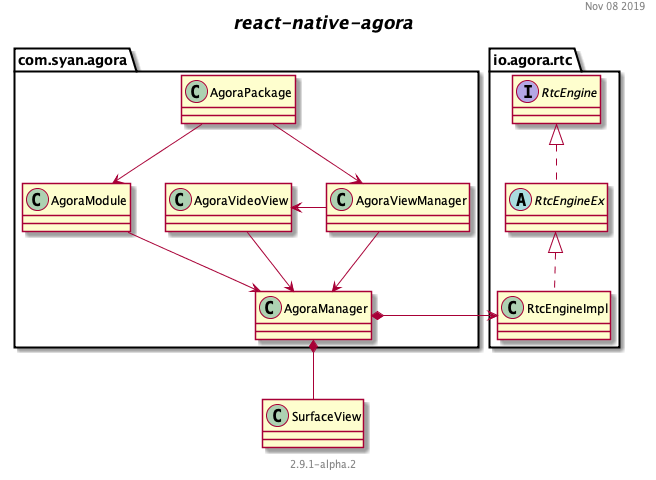

# Bunch patch for <i>react-native-agora</i>


This patch updates <i>react-native-agora</i> to render both local and remote previews into TextureViews instead of SurfaceViews.

## Why TextureViews?

Unlike SurfaceView, TextureView does not create a separate window but behaves as a regular View. This key difference allows a TextureView to be moved, transformed, animated, etc. For instance, you can make a TextureView semi-translucent by calling myView.setAlpha(0.5f).

## What does this patch do?



It updates `com.syan.agora` package to use classes from `live.bunch.agora` instead.


## How to patch a new android version of react-native-agora?

1. Copy `live.bunch.agora` package to `android/src/main/java/`

2. Update `AgoraPackage.java` file imports

	```
	// android/src/main/java/com/syan/agora/AgoraPackage.java
	package com.syan.agora;
	
	import live.bunch.agora.AgoraViewManager;
	
	//...
	```

3. Update `AgoraModule.java` file imports

	```
	// android/src/main/java/com/syan/agora/AgoraModule.java
	package com.syan.agora;
	
	import live.bunch.agora.AgoraManager;
	
	//...
	```

4. Update `AgoraVideoView.java` file imports

	```
	// android/src/main/java/com/syan/agora/AgoraModule.java
	package com.syan.agora;
	
	import live.bunch.agora.AgoraManager;
	
	//...
	```
	
That's it.


## Copyright

```
Copyright © 2019 Bunch. All rights reserved.
```

